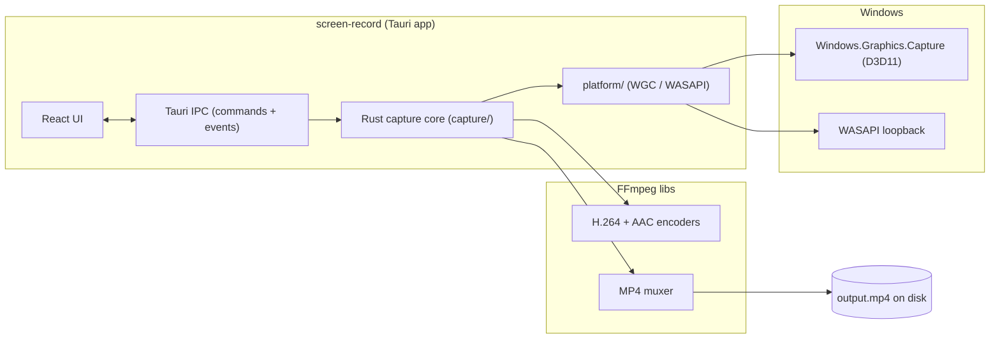
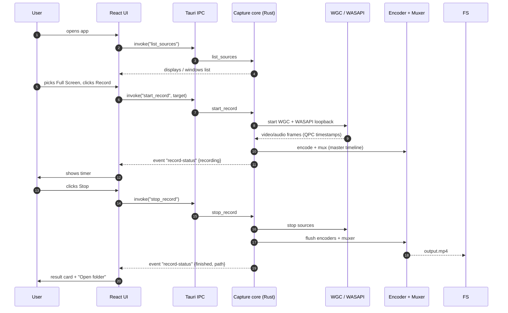
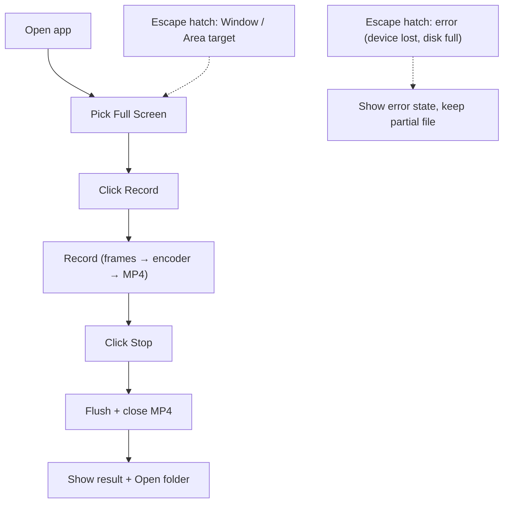

# 01. System Context And Record Flow

- **ADR reference**: [0001. Rust capture logic, React UI only](../adr/0001-rust-capture-logic-react-ui.md)
- **Related diagram**: [02. A/V Synchronization Pipeline](02-av-sync-pipeline.md)
- **Purpose**: system context (boundaries), happy-path record flow, KISS default path, and the start/stop sequence between React, Rust, and the OS capture APIs.

Scope: end-to-end of one recording session — source selection through a
playable MP4. It is *not* about internal A/V sync mechanics (see 02) or
failure branches (see the Failure Handling section in 02).

## System Context

## Happy-Path Record Sequence

Invariants:

- Exactly one recording session at a time (v1).
- `stop_record` is idempotent — the second call is a no-op.
- The file is only reported as finished after the muxer flushes and closes.

## KISS Default Path

KISS defaults:

- Default target is **Full Screen** (single display). Window/Area are escape
  hatches through the same pipeline (different bounds only).
- Default quality **Standard**; High is a setting, not a separate path.
- One recording at a time; no pause in v1.
