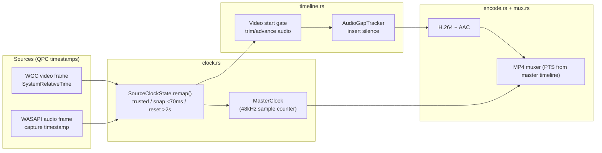
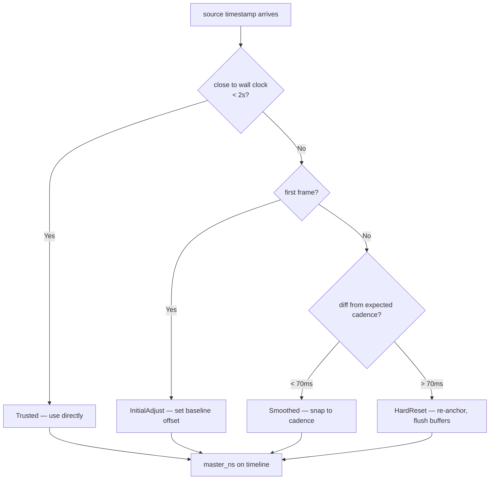
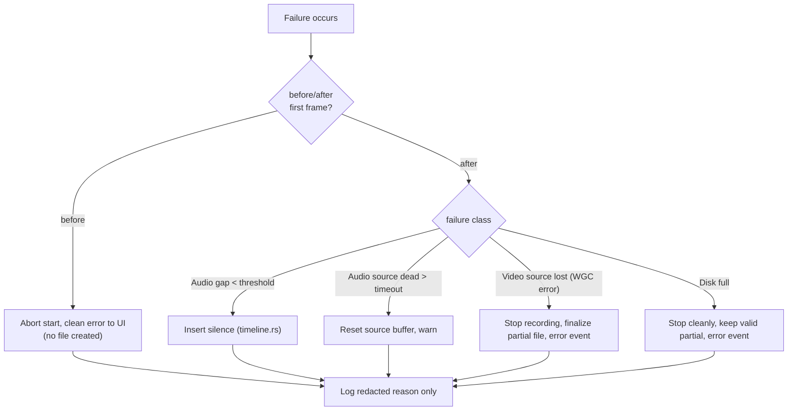

# 02. A/V Synchronization Pipeline

- **ADR reference**: [0003. Single master clock for A/V sync](../adr/0003-single-master-clock-for-av-sync.md)
- **Related diagram**: [01. System Context And Record Flow](01-system-context-and-record-flow.md)
- **Purpose**: internal data flow for synchronization — source timestamps → MasterClock remap, first-frame alignment, gap handling, and failure handling.

Scope: what happens to every video/audio frame between capture and the
encoder, and how the pipeline fails safely. UI flows are in 01.

## Frame → Master Timeline Flow

## Verification / Decision Flowchart (SourceClock remap)

## Failure Handling

## Implementation Checklist

1. Port `clock.rs` (MasterClock + SourceClockState) with Cap's unit tests first.
2. Port `timeline.rs` (video start gate, gap tracker, tail padding) with
   synthetic-frame tests.
3. Wire WGC video source (`platform/windows.rs`) into the pipeline (M2).
4. Wire WASAPI loopback audio source into the pipeline (M3).
5. Add encoder + muxer (`encode.rs`, `mux.rs`) with PTS from master timeline (M4).
6. Emit `record-status` / `preview-frame` events; React subscribes (M5).
7. Tests: clock jitter/reset, first-frame alignment, gap fill, long-run drift check.
