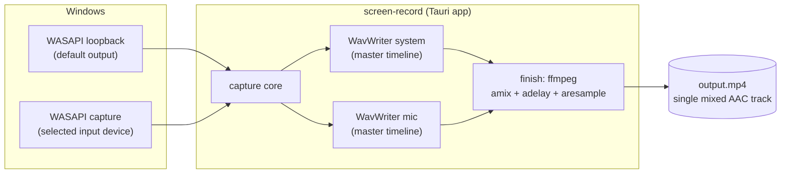
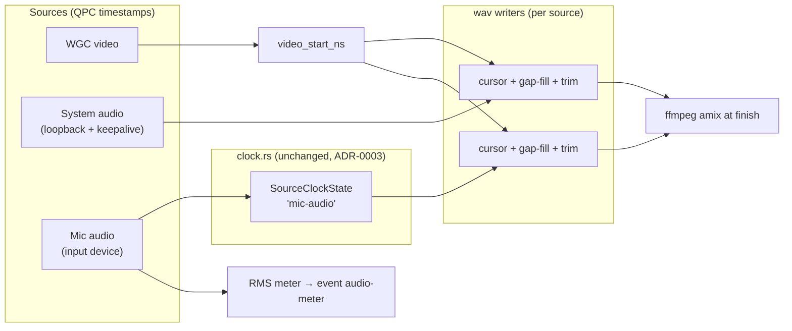
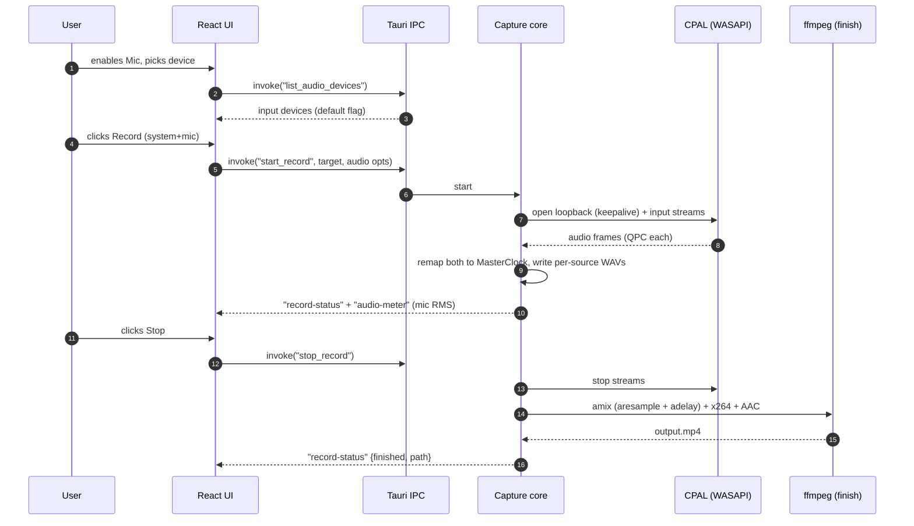
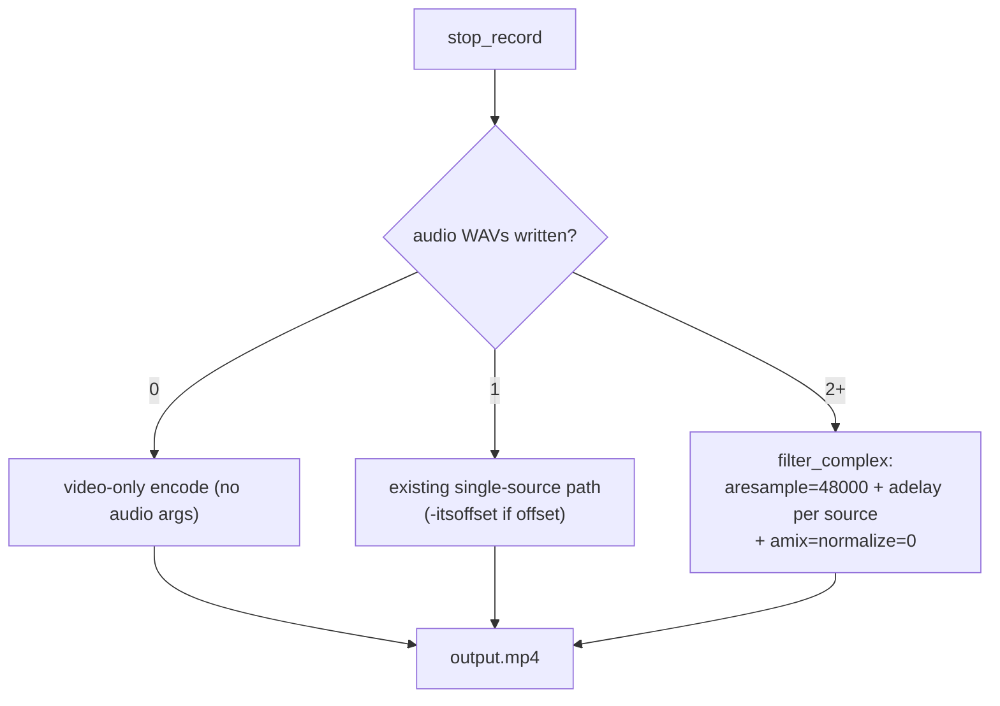
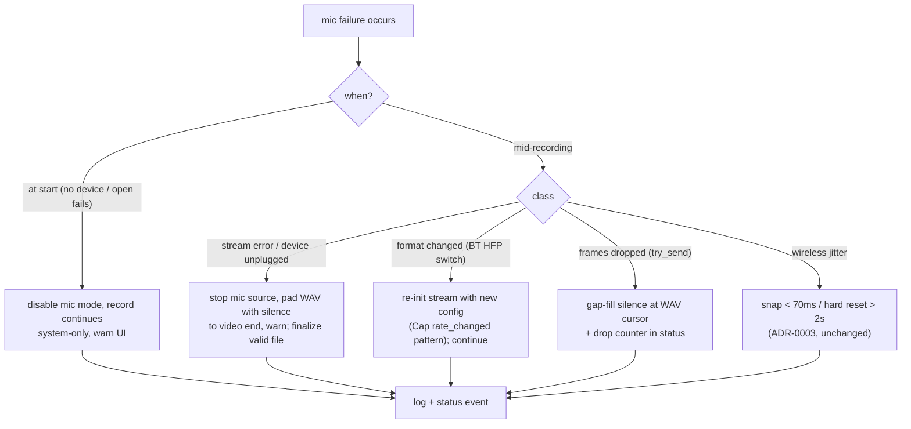

# 03. Microphone Capture And Mixing

- **ADR reference**: [0012. Microphone capture via CPAL input](../adr/0012-microphone-capture-cpal-input.md), [0013. Mix at finish via ffmpeg](../adr/0013-defer-audio-mixing-to-ffmpeg-at-finish.md)
- **Related diagram**: [01. System Context And Record Flow](01-system-context-and-record-flow.md), [02. A/V Synchronization Pipeline](02-av-sync-pipeline.md)
- **Purpose**: data flow and sequences for the second audio source (mic) — capture, timeline-rendered per-source WAVs, finish-time mixing, metering, and mic-specific failure handling.

Scope: what changes when a microphone joins the recording. Shared A/V sync
mechanics (MasterClock remap, snap/reset) are in 02 and are reused unchanged.

## System Context (delta)

## Frame Flow (mic joins the existing pipeline)

Invariants:

- One `MasterClock`, one QPC anchor — mic adds a `SourceClockState`, never a clock.
- Each WAV is a faithful render of its source's master-timeline span
  (gap → silence, early-start → trim, late-start → `adelay` at finish).
- Callbacks never block: `try_send` + drop counter, per source.

## Record With Mic (happy path)

## Finish Path Selection

## Failure Handling (mic-specific)

## Implementation Checklist

1. `list_audio_devices` command (CPAL `input_devices`) + UI dropdown & mode toggle.
2. Extract per-source `WavWriter` from `mux.rs`: sample cursor, gap-fill,
   first-frame trim — unit tests first (synthetic gaps, early/late starts).
3. Generalize `audio.rs` capturer: input mode vs loopback mode (keepalive only
   for loopback); second audio thread in `capture/mod.rs`.
4. Pump: `SourceClockState("mic-audio")`, per-source WAV writes, RMS →
   `audio-meter` event (throttled ~100ms).
5. `finish()`: multi-WAV `filter_complex` (amix/adelay/aresample); single-source
   path unchanged; `normalize=0`, clamp before AAC.
6. Robustness: mic unplug → pad + warn; format mismatch → re-init.
7. Tests: WavWriter gap/trim units; `examples/capture_test.rs` with mic;
   ffprobe asserts single AAC track; clap/waveform offset check ≤ 50ms.
