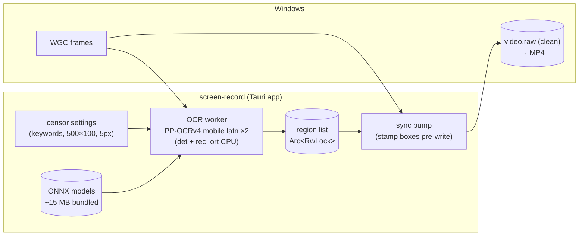
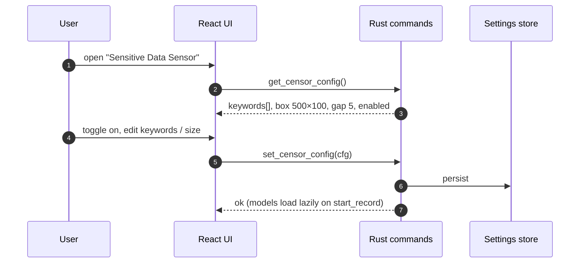
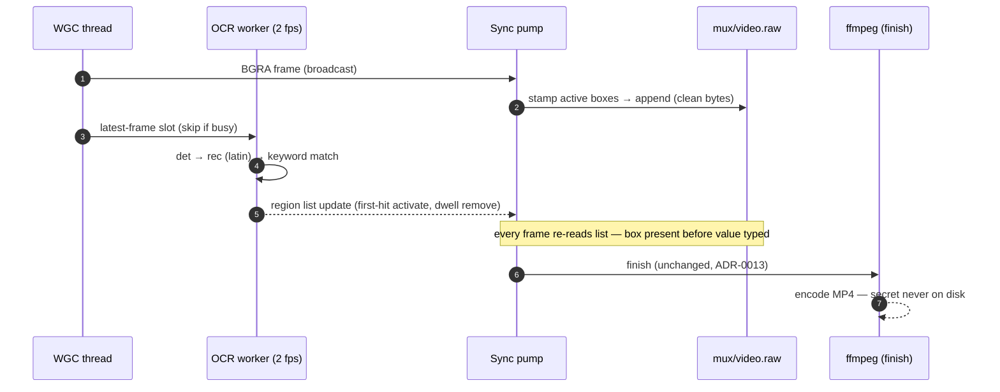
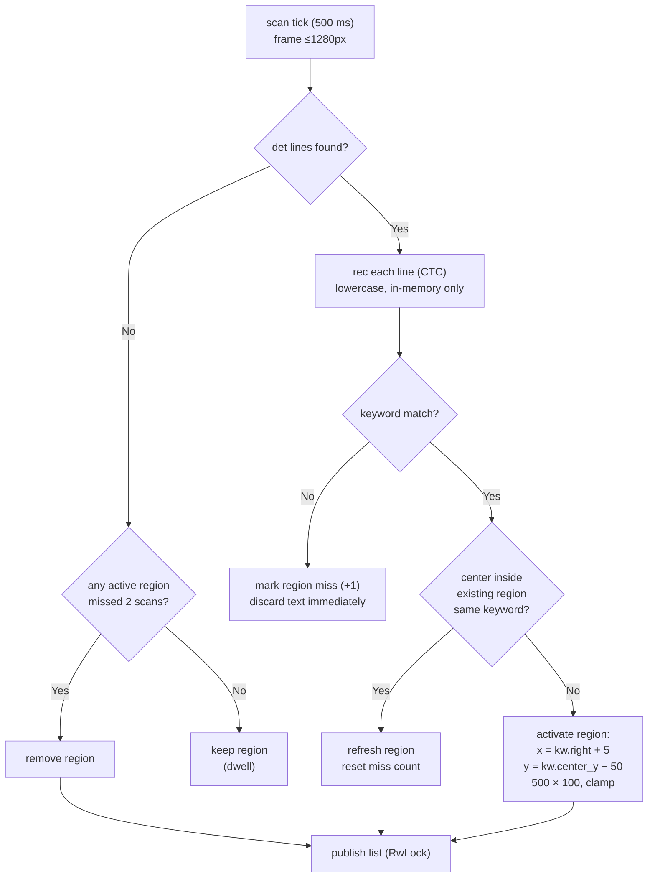
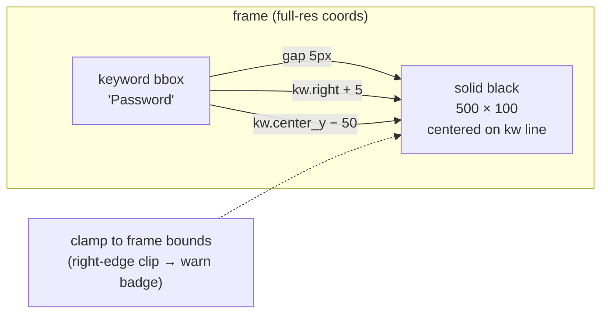
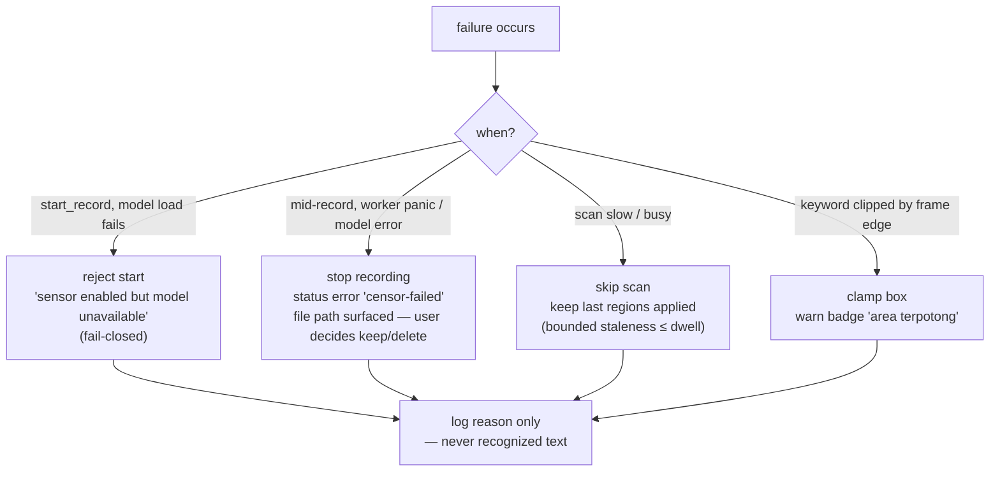
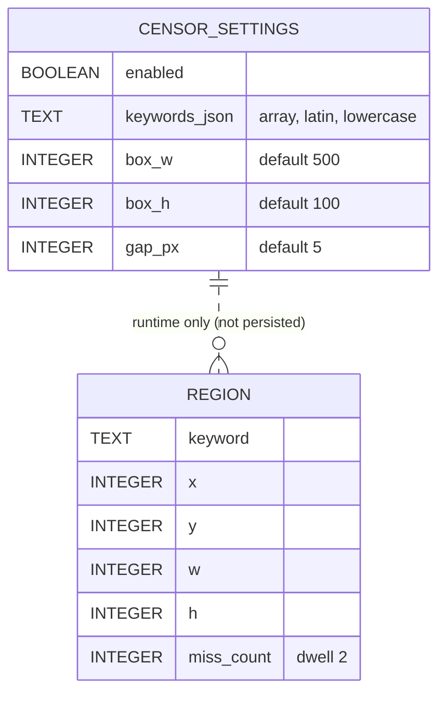

# 04. Sensitive Data Censoring

- **ADR reference**: [0014. Sensitive-data detection with PaddleOCR mobile latin via ONNX](../adr/0014-sensitive-data-detection-paddleocr-mobile-latn-onnx.md), [0015. Censor boxes stamped pre-disk-write with dwell](../adr/0015-censor-boxes-stamped-pre-encode-with-region-dwell.md)
- **Related diagram**: [01. System Context And Record Flow](01-system-context-and-record-flow.md), [02. A/V Synchronization Pipeline](02-av-sync-pipeline.md)
- **Purpose**: views for the censor feature — system context delta, pre-record setup flow, record-time sequence, scan/region verification flow, and censor-specific failure handling.

Scope: what joins the pipeline when censoring is enabled. Shared capture,
clock, and finish-time encode mechanics are unchanged from 01/02/03 and are
not repeated here.

## System Context (delta)

## Pre-Record Setup (settings before record)

Invariants:

- Settings are written and validated **before** Record is pressed; no config
  changes mid-recording (v1).
- Preset keywords latin, case-insensitive; minimum practical length 4 chars.

## Record With Censoring (happy path)

## Scan → Region Verification Flow

Notes:

- First detection activates immediately (no confirmation wait) — the leak
  window is only the scan interval.
- Full recognized text beyond the matched keyword is never stored, logged,
  or emitted.

## Geometry

## Failure Handling

## Data Model Extension

- Settings: persisted app config (source of truth).
- Region list: process memory only, rebuilt from live scans.

## Implementation Checklist

1. `capture/censor/mod.rs`: config struct, region tracker (activate/refresh/
   dwell), geometry + clamp — unit tests first (pure functions).
2. Sync-pump hook: stamp boxes on BGRA before `video.raw` append; no-op when
   disabled.
3. `capture/censor/ocr.rs`: `ort` sessions ×2, pre/post-processing, keyword
   match worker; golden-output tests for DB + CTC helpers.
4. Bundle pinned ONNX models; fail-closed check at `start_record`.
5. UI: pre-record settings panel + `censor-status` badge + preview boxes.
6. Acceptance: form-login 30 s recording frame-checked; zero-regression run
   with censoring off.
